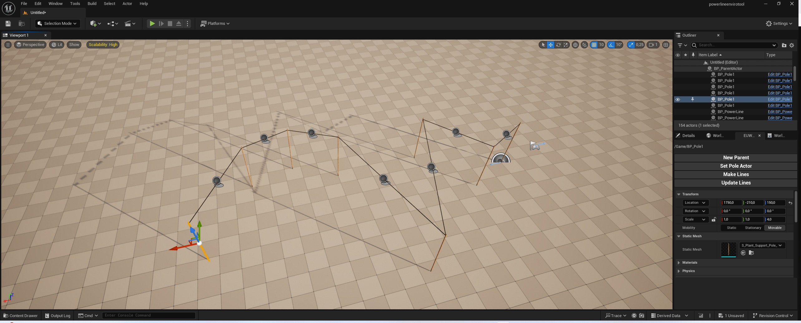
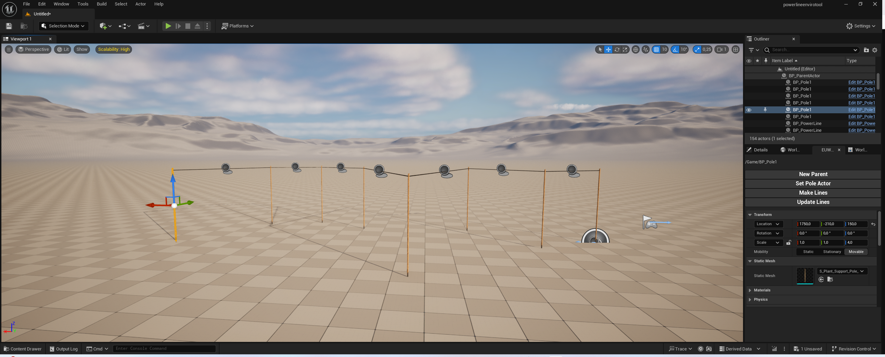
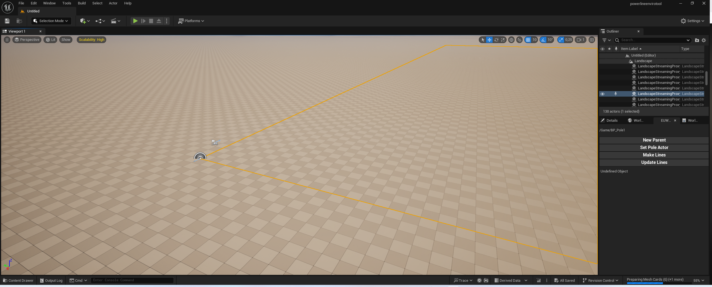
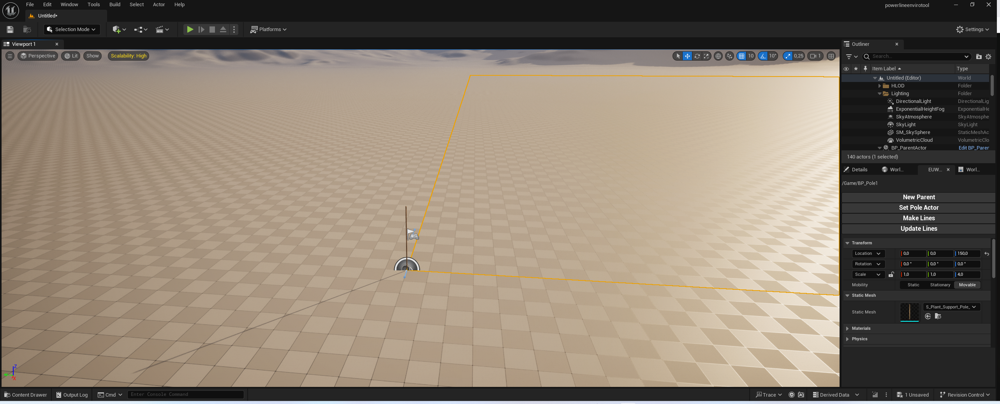
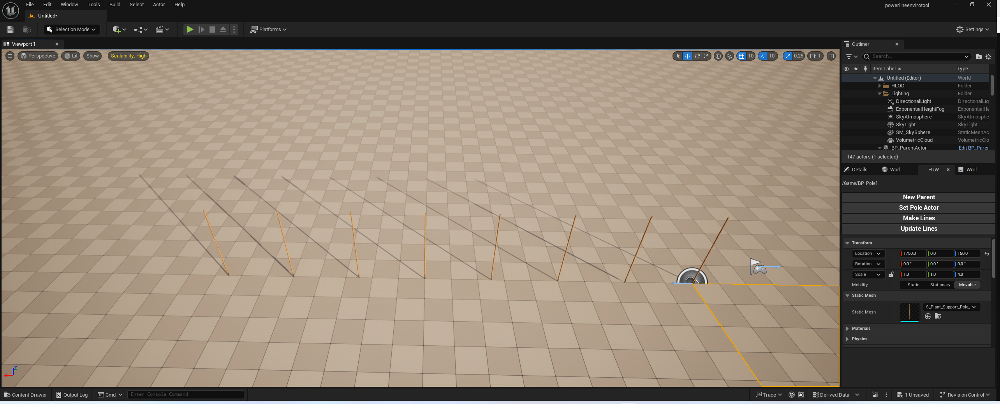
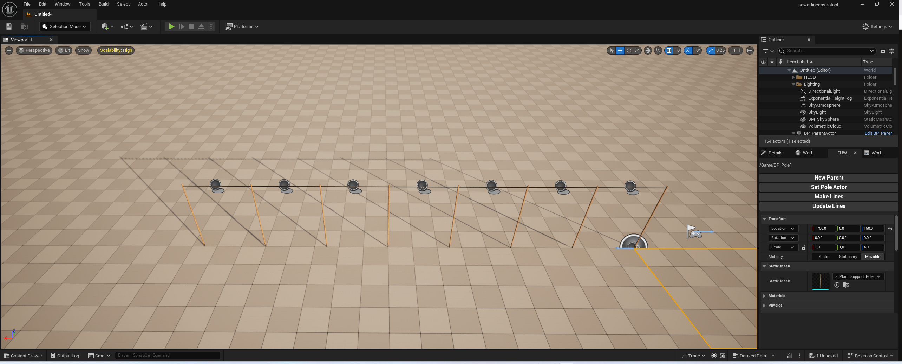

# UE5 Power Line Tool

 

This repository contains a custom tool for Unreal Engine 5 designed to efficiently create and manage power lines within your game environment. The tool is ideal for developers who want to quickly set up realistic power line networks in open-world or urban settings, with flexibility and ease of use in mind.

## Features

- **Spline-Based Power Line Creation**: Utilize Unreal Engine's spline system to create and manipulate power lines. The tool allows for easy adjustments to line curves and lengths, providing a high level of control over the final layout.
- **Customizable Pole Placement**: Automatically place power poles along the spline at specified intervals. Poles can be customized in terms of model, height, and spacing, giving you the flexibility to match the aesthetic of your project.
- **Dynamic Wire Simulation**: Wires dynamically adjust based on the distance between poles, with realistic sagging and tension to simulate real-world physics.
- **LOD (Level of Detail) Support**: Integrates with Unreal Engine's LOD system to ensure performance efficiency by reducing detail for distant power lines, optimizing rendering in large environments.
- **Blueprint Integration**: The tool is fully integrated with Unreal Engine's Blueprint system, making it easy to extend and customize for specific project needs.
- **Easy Integration**: Designed to be plug-and-play, this tool can be easily integrated into existing projects with minimal setup.

## Usage

- **Creating Power Lines**: Use the spline component to draw power lines across your map. Adjust the spline points to set the direction and curvature of the lines.
- **Customizing Poles and Wires**: Modify the properties of poles and wires directly within the Blueprint editor or through exposed parameters to achieve the desired visual and physical effects.
- **Optimizing Performance**: Adjust LOD settings to balance visual fidelity and performance, particularly in large, open-world environments.
